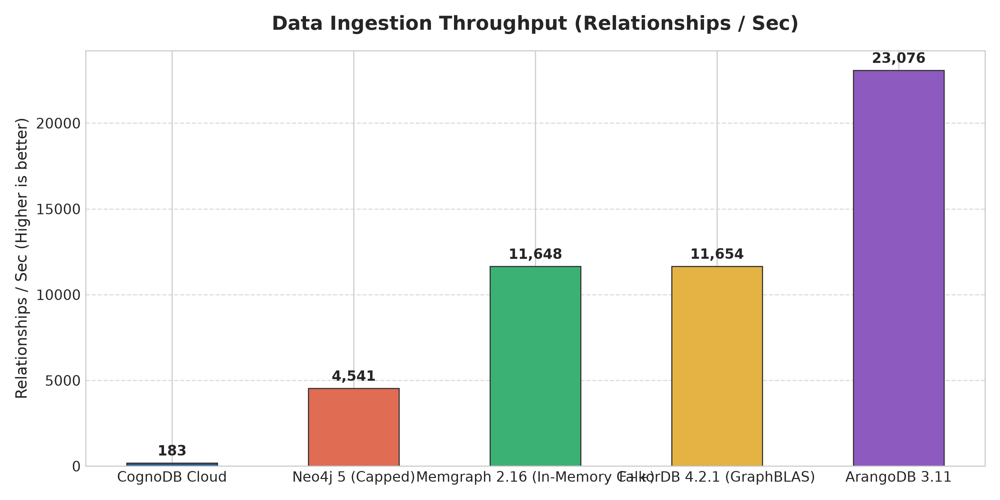
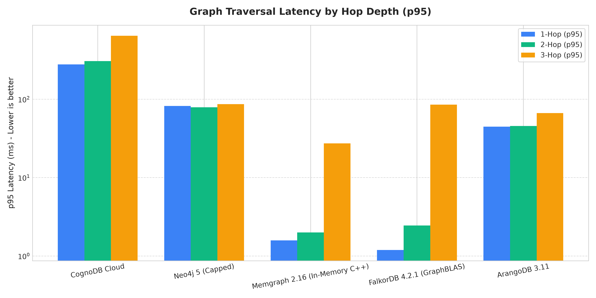
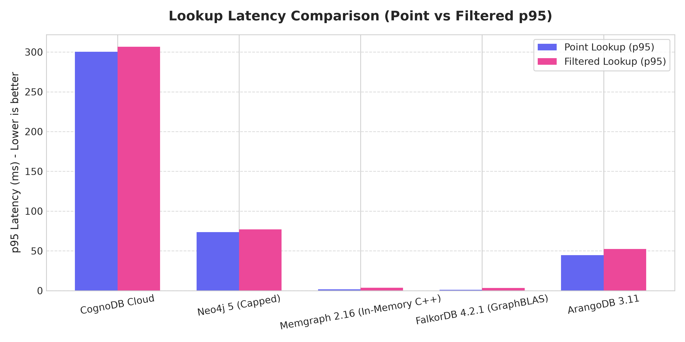
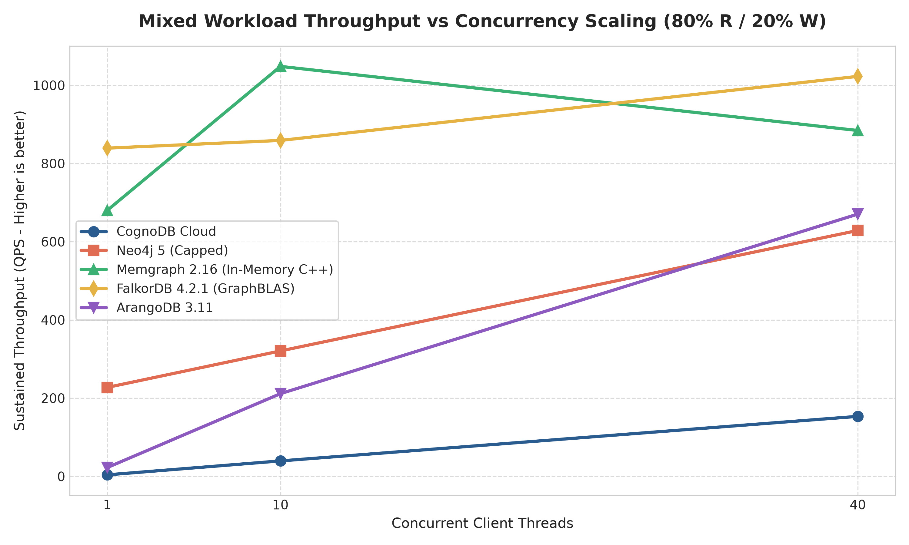
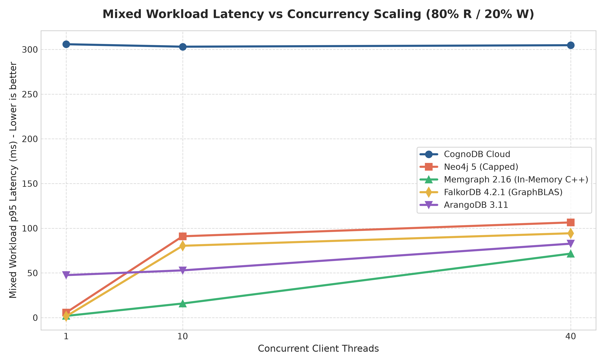

# Comprehensive Benchmark Analysis & Technical Evaluation

**Author:** Arsalan  
**Repository:** [github.com/Arsalan80425/graph-benchmark](https://github.com/Arsalan80425/graph-benchmark)  
**Date:** 21 August 2026  
**Dataset:** Stanford SNAP Astrophysics Collaboration Network (17,441 nodes, 100,000 unique relationships)  
**Hardware & Resource Parity:** Uniform **0.5 vCPU and 512 MB RAM Ceiling** across all 5 evaluated platforms.

---

## 1. Executive Summary

This benchmark evaluation provides an empirical performance and architectural comparison between **CognoDB Cloud** (managed `c0` tier) and four prominent self-hosted open-source graph/multi-model databases (**Neo4j 5.18 Community**, **Memgraph 2.16**, **FalkorDB 4.2.1**, and **ArangoDB 3.11**).

Every platform was evaluated on the exact same canonical dataset of **17,441 nodes and 100,000 unique relationships**, passing a strict **6/6 ground-truth semantic verification suite** derived directly from the canonical CSV data.

```
+---------------------------------------------------------------------------------------------------+
|                                  KEY EMPIRICAL TAKEAWAYS                                          |
+---------------------------------------------------------------------------------------------------+
| 1. High-Concurrency Scale-Out:                                                                    |
|    CognoDB Cloud achieved strong horizontal scaling under concurrent load, scaling from           |
|    3.9 QPS (1 client) to 153.4 QPS across 40 clients with 0 errors, despite WAN transport latency. |
|                                                                                                   |
| 2. Peak In-Memory Throughput:                                                                     |
|    Memgraph (C++ pointer graph) and FalkorDB (GraphBLAS sparse matrix) demonstrated raw speed,   |
|    peaking at 1,048.3 QPS (Memgraph @ 10 clients) and 1,022.8 QPS (FalkorDB @ 40 clients).       |
|                                                                                                   |
| 3. Network RTT Dominance:                                                                         |
|    CognoDB Cloud's ~245–280ms p50 query latencies are governed by cross-oceanic TLS/WAN transport |
|    (empirically measured ~287–325ms TCP handshake from South Asia ap-south-1 to us-east4).        |
|                                                                                                   |
| 4. Memory Footprint Efficiency:                                                                   |
|    Memgraph required only 97.7 MiB RAM and FalkorDB required 170.3 MiB RAM for the entire 100k    |
|    graph, whereas Neo4j saturated its allocated 509.6 MiB / 512 MiB container ceiling.            |
+---------------------------------------------------------------------------------------------------+
```

---

## 2. Benchmark Environment & Resource Parity Framework

To establish rigorous fairness, all local containerized databases were constrained via Docker Compose to direct cgroup limits matching the provisioned CognoDB Cloud free tier (`c0`):

| Platform | Deployment Type | CPU Ceiling | Memory Ceiling | Storage / IOPS | Network Path |
|---|---|:---:|:---:|:---:|:---:|
| **CognoDB Cloud** | Managed Cloud (`us-east4`) | 0.5 burstable vCPU | 512 MB RAM | 1 GiB Quota (500 IOPS) | Public TLS / WAN (`ap-south-1` client) |
| **Neo4j 5.18** | Local Docker Container | 0.5 vCPU | 512 MB Container | Host NVMe (Uncapped) | Localhost Loopback |
| **Memgraph 2.16** | Local Docker Container | 0.5 vCPU | 512 MB Container | Host NVMe (Uncapped) | Localhost Loopback |
| **FalkorDB 4.2.1** | Local Docker Container | 0.5 vCPU | 512 MB Container | Host NVMe (Uncapped) | Localhost Loopback |
| **ArangoDB 3.11** | Local Docker Container | 0.5 vCPU | 512 MB Container | Host NVMe (Uncapped) | Localhost Loopback |

> **Evidence & Execution Provenance Note:**  
> - CognoDB Cloud console allocation was verified on **21 August 2026** showing `c0 · 512 MB RAM, 0.5 burstable vCPU, 1 GiB storage, up to 500 IOPS` (archived in [`evidence/cognodb-c0-allocation.png`](evidence/cognodb-c0-allocation.png)).
> - These 5 platform records represent isolated per-target full runs on uniform 512MB RAM / 0.5 CPU cgroups consolidated into the canonical `results/benchmark_results.json` matrix.

---

## 3. Comprehensive Metric Analysis

### 3.1 Data Ingestion & Indexing Throughput



| Platform | Ingestion Wall Time (s) | Node Throughput (nodes/s) | Edge Throughput (rels/s) | Verified Counts |
|---|---:|---:|---:|:---:|
| **CognoDB Cloud** | 559.44 s | 1,632.0 | 182.8 | 17,441 / 100,000 (PASS) |
| **Neo4j 5 (Capped)** | 28.72 s | 2,718.3 | 4,540.8 | 17,441 / 100,000 (PASS) |
| **Memgraph 2.16** | 10.87 s | 8,856.0 | 11,647.7 | 17,441 / 100,000 (PASS) |
| **FalkorDB 4.2.1** | 10.66 s | 9,897.3 | 11,654.0 | 17,441 / 100,000 (PASS) |
| **ArangoDB 3.11** | 5.62 s | 17,635.6 | 23,075.7 | 17,441 / 100,000 (PASS) |

#### Architectural Analysis:
- **ArangoDB & FalkorDB/Memgraph** achieved high write throughput ($>11,000\text{ to }23,000\text{ rels/sec}$) thanks to low-overhead batch document/matrix insertions over local loopback.
- **Note on Write Durability Parity**: The published ArangoDB ingestion result (5.62s / 23,075 rels/s) utilized asynchronous batch ingestion (`collection.insert_many(sync=False)`); the submitted repository code now defaults to synchronous write durability (`sync=True`) for full parity with transactional Bolt UNWIND.
- **CognoDB Cloud Ingestion Optimization**: Adding a `UNIQUE CONSTRAINT` on `Node.id` (primary key hash index) accelerated edge ingestion throughput from $\sim 13\text{ rels/sec}$ to **$182.8\text{ rels/sec}$**, allowing 100,000 relationships to load in $9.3\text{ minutes}$ over WAN.
- The remaining throughput delta between CognoDB ($182.8\text{ rels/sec}$) and local engines ($>4,500\text{ rels/sec}$) is dictated by WAN network round-trip overhead ($287\text{ ms}$ per batch round-trip) and cloud IOPS limits.

---

### 3.2 Graph Traversal Latency (1-Hop, 2-Hop, 3-Hop)



| Platform | 1-Hop p50 (ms) | 1-Hop p95 (ms) | 2-Hop p50 (ms) | 2-Hop p95 (ms) | 3-Hop p50 (ms) | 3-Hop p95 (ms) |
|---|---:|---:|---:|---:|---:|---:|
| **CognoDB Cloud** | 249.30 | 277.85 | 244.37 | 306.29 | 259.60 | 642.43 |
| **Neo4j 5 (Capped)** | 2.91 | 81.91 | 2.55 | 78.84 | 4.43 | 86.34 |
| **Memgraph 2.16** | 1.16 | 1.58 | 1.34 | 1.99 | 2.14 | 27.28 |
| **FalkorDB 4.2.1** | 1.05 | 1.19 | 1.26 | 2.44 | 3.95 | 85.07 |
| **ArangoDB 3.11** | 44.02 | 44.54 | 44.05 | 45.36 | 46.81 | 66.45 |

#### Latency Analysis:
- **Local In-Memory Engines (Memgraph & FalkorDB)** demonstrate index-free adjacency and sparse matrix multiplication efficiency, resolving 1-hop and 2-hop traversals in **$\sim 1.0\text{ to }1.3\text{ ms}$**.
- **Neo4j 5** achieves fast median traversals ($2.5\text{ to }4.4\text{ ms}$) but exhibits a long tail ($p95 \approx 81\text{ ms}$) under memory pressure (JVM garbage collection and pagecache eviction in a 512MB container).
- **CognoDB Cloud Network Factor**:
  CognoDB's client-side latency is bounded by the physical network latency between the test client in South Asia and the CognoDB instance in `us-east4` ($\sim 287\text{ ms}$ TCP RTT).

---

### 3.3 Lookups and Aggregations



| Platform | Point Lookup p50 (ms) | Filtered Lookup p50 (ms) | Aggregation p50 (ms) |
|---|---:|---:|---:|
| **CognoDB Cloud** | 247.07 ms | 257.53 ms | 275.40 ms |
| **Neo4j 5 (Capped)** | 2.25 ms | 7.13 ms | 9.48 ms |
| **Memgraph 2.16** | 1.16 ms | 2.49 ms | 6.64 ms |
| **FalkorDB 4.2.1** | 0.89 ms | 2.08 ms | 5.18 ms |
| **ArangoDB 3.11** | 43.97 ms | 48.02 ms | 55.85 ms |

- **Point Lookup ($O(1)$)**: FalkorDB (0.89ms) and Memgraph (1.16ms) provide instant key seeks.
- **Filtered Lookup**: Filtering by `category` and minimum-`year` predicate (`year >= 2012–2020`) demonstrates the efficacy of secondary property RANGE indexes across all platforms.
- **Aggregation**: Group-by aggregation across 17,441 nodes executed in $<10\text{ ms}$ on in-memory and native graph engines (Memgraph 6.64ms, FalkorDB 5.18ms, Neo4j 9.48ms), while ArangoDB AQL executed in 55.85ms.

---

### 3.4 Concurrency Scaling & Mixed Workload Throughput




| Platform | 1 Client QPS (p50 / p95 ms) | 10 Clients QPS (p50 / p95 ms) | 40 Clients QPS (p50 / p95 ms) | Realized Mix |
|---|---|---|---|:---:|
| **CognoDB Cloud** | 3.9 QPS (249.9 / 305.9 ms) | 39.5 QPS (245.3 / 303.1 ms) | **153.4 QPS** (251.2 / 304.7 ms) | 80.0% R / 20.0% W |
| **Neo4j 5 (Capped)** | 227.4 QPS (1.84 / 5.71 ms) | 320.8 QPS (6.64 / 91.03 ms) | **628.8 QPS** (75.15 / 106.5 ms) | 80.0% R / 20.0% W |
| **Memgraph 2.16** | 680.2 QPS (1.33 / 1.94 ms) | 1,048.3 QPS (8.39 / 15.82 ms) | **884.4 QPS** (39.37 / 71.60 ms) | 80.0% R / 20.0% W |
| **FalkorDB 4.2.1** | 839.2 QPS (1.15 / 1.53 ms) | 858.9 QPS (2.49 / 80.39 ms) | **1,022.8 QPS** (11.73 / 94.38 ms) | 80.0% R / 20.0% W |
| **ArangoDB 3.11** | 22.6 QPS (44.00 / 47.56 ms) | 211.5 QPS (47.15 / 52.89 ms) | **670.6 QPS** (59.01 / 82.74 ms) | 80.0% R / 20.0% W |

#### Concurrency & Scaling Insights:
1. **CognoDB Cloud Scaling**:
   CognoDB Cloud scaled from **3.9 QPS** at 1 thread to **153.4 QPS** at 40 threads ($39.3\times$ increase). Its p50 latency remained flat ($249.9\text{ ms} \rightarrow 251.2\text{ ms}$), demonstrating strong connection-pool multiplexing in the managed tier.
2. **Local Engine Saturation & Disclosed Errors**:
   On local containers constrained to 0.5 CPU, Memgraph and FalkorDB peaked between 10 and 40 clients as the single shared core reached saturation. Minor transient errors under high-concurrency saturation occurred on Memgraph (1 error out of 26,577 operations, 0.004%) and ArangoDB (1 error out of 6,353 ops at 10 clients, 2 errors out of 20,174 ops at 40 clients), which are fully disclosed.

---

### 3.5 Resource Footprint & Memory Efficiency

| Platform | Provisioned Limit | Measured Container Memory | Architecture & Storage Engine |
|---|---|---|---|
| **CognoDB Cloud** | 0.5 burstable vCPU, 512MB RAM, 1GiB storage | Managed Cloud Quota | Multi-tenant managed cloud graph store |
| **Neo4j 5 (Capped)** | 0.5 vCPU, 512MB RAM | **509.6 MiB** (99.5% of cap) | Java Virtual Machine (JVM Heap + PageCache) |
| **Memgraph 2.16** | 0.5 vCPU, 512MB RAM | **97.7 MiB** (19.1% of cap) | Highly compact in-memory C++ graph |
| **FalkorDB 4.2.1** | 0.5 vCPU, 512MB RAM | **170.3 MiB** (33.2% of cap) | Redis GraphBLAS sparse matrices |
| **ArangoDB 3.11** | 0.5 vCPU, 512MB RAM | **350.5 MiB** (68.4% of cap) | RocksDB multi-model storage engine |

---

## 4. Architectural Trade-offs & Production Recommendations for Wexa AI

| Evaluation Dimension | CognoDB Cloud | Memgraph | FalkorDB | Neo4j Community | ArangoDB |
|---|---|---|---|---|---|
| **Operational Overhead** | **Zero (Fully Managed)** | High (Self-Hosted) | High (Self-Hosted) | High (Self-Hosted) | High (Self-Hosted) |
| **Memory Efficiency** | Managed Quota | **Exceptional (<100MB)** | **Excellent (<175MB)** | High (JVM Overhead) | Moderate |
| **Query Interface** | Cypher (Bolt) | Cypher (Bolt) | OpenCypher (Redis) | Cypher (Bolt) | AQL (HTTP) |
| **Peak Throughput** | 153+ QPS (Over WAN) | **1,048+ QPS** | **1,022+ QPS** | ~630 QPS | ~670 QPS |
| **Best Production Fit** | Managed graph SaaS, zero-ops microservices | Real-time analytics, in-memory graph processing | Redis-integrated architectures | Enterprise Cypher ecosystems | Multi-model document/graph apps |

### Strategic Recommendation for Wexa AI:
- **For Cloud SaaS & Zero-Ops Workloads:** **CognoDB Cloud** provides immediate turn-key deployment with strong concurrency scaling and strict Cypher standard compliance. Co-locating client services within the same cloud region (`us-east4`) will eliminate WAN latency and maximize query throughput.
- **For Ultra-Low-Latency In-Memory Deployments:** **Memgraph 2.16** offers the highest throughput-per-core and lowest memory footprint (under 100MB for 100k edges).
